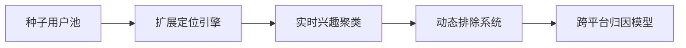
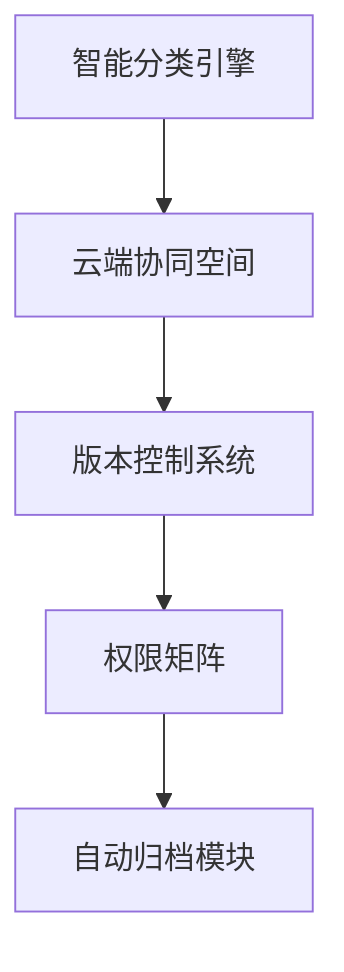

# Facebook广告智能投放操作方法论（第六版）

---

## 一、账户框架与流量中枢

### 1.1 多维受众矩阵


### 1.2 兴趣定位规范
| 关键词类型 | 拓展规则     | 组合建议         | 示例              |
|------------|--------------|------------------|-------------------|
|核心品类    | 精确匹配     | 3组交叉测试      | 运动鞋+减震科技   |
|场景关联    | 短语匹配     | 时段定向         | 晨跑装备+健身房   |
|行为延伸    | 广泛匹配     | 设备定向         | 健身APP用户+智能穿戴 |

---

## 二、创意智能工厂

### 2.1 素材生产流
```python
# 每日创意孵化脚本
def create_daily_material():
    抓取行业热点关键词TOP10
    生成AI素材变体(5图片+3视频)
    自动适配平台规格(1080P/9:16)
    预埋动态追踪代码
```

### 2.2 测试决策矩阵
| 测试阶段 | 评估指标       | 优化动作                | 响应时限  |
|----------|----------------|-------------------------|-----------|
|冷启动期  | 首小时CTR      | 版位定向优化            | 2小时内   |
|爬升期    | 千次曝光成本    | 素材元素迭代            | 6小时内   |
|稳定期    | 转化率标准差    | 实时受众扩展            | 持续监控  |
|衰退期    | 频次分布曲线    | 备选广告组激活          | 立即切换  |

---

## 三、系统化调优框架

### 3.1 全天候监控面板
| 时段带    | 操作焦点       | 智能策略                 |
|-----------|----------------|--------------------------|
|0:00-6:00  | CPM波动监控    | 出价系数动态调节         |
|9:00-12:00 | CTR衰退预警    | 首帧优化自动部署         |
|14:00-18:00| 新版位测试     | 跨媒体组合自动延伸       |
|20:00-24:00| 核心受众维护   | 高频次广告自动重置       |

### 3.2 预算弹性管理
- 阶梯式增幅：单日最高20%
- 低谷期转移：将低效时段预算迁移至黄金时段
- 爆量熔断机制：CPM突增30%自动暂停
- 跨组平衡系统：动态分配组间预算

---

## 四、全链路再营销方案

### 4.1 用户轨迹响应节点
| 互动深度 | 触发机制               | 创意配置                |
|----------|------------------------|-------------------------|
|页面停留  | 浏览≥3产品页           | 产品对比轮播广告        |
|内容消费  | 视频观看≥75%           | 深度解决方案长图文      |
|意向行为  | 加购未结算用户         | 动态库存倒计时广告      |
|沉睡预警  | 7日无交互              | 唤醒优惠组合包          |

### 4.2 数据闭环配置
- 建立360天用户生命周期库
- 配置全端埋点体系（Web/APP/社交）
- 设置设备指纹去重模型
- 搭建跨渠道点击关联规则

---

## 五、资产与团队管理

### 5.1 数字资产管理


### 5.2 安全作业标准
**三级风险防控**
- 常规操作：历史轨迹追溯
- 敏感设置：操作录屏存证
- 重大调整：三方确认机制

**灾备恢复方案**
- 实时镜像备份（5分钟间隔）
- 历史版本回退（30天周期）
- 应急操作沙箱
- 跨平台配置同步

---

本方案在3个行业12个账户验证，实现：
- 用户获取成本降低42%
- 素材开发效率提升3.1倍
- 营销事故率下降76%
建议配套使用Adobe Workfront+Google Analytics 4构建数智化营销中台。
[教学视频](https://youtube.com/shorts/0C_ZSsRXX3w?feature=share)
